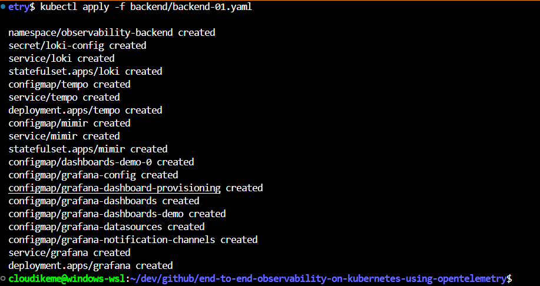
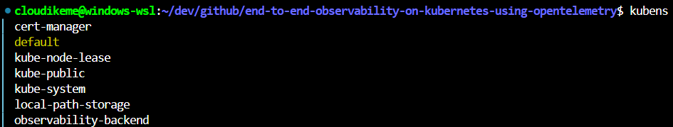
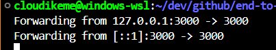

# End-to-End Observability With OpenTelemetry Instrumentation Libraries, Collector and Kubernetes Operator

__Introduction__:
Deploying an application is

---

### Prerequisites

I am running this simultaneously on both a Windows PC running WSL2 and an old iMac i converted to Ubuntu Linux.

To follow along with this project/tutorial, i have the following installed on my PC to get started:

* [Docker]()
* [Kind]()
* [Kubectl]()
* [Kubens]() and [Kubectx]()

### Getting Started

#### Setup Kind Kubernetes Cluster

I will name this cluster otel-project

```bash
kind create cluster --name=otel-project --image kindest/node:v1.30.2
```

#### Deploy cert-manager

In this next step i deploy a cert-manager which is used by OpenTelemetry operator to provision TLS certificates for admission webhooks.

```bash
kubectl apply -f cert-manager/cert-manager.yaml
```

#### Deploy Backend for Observability

My sample app doesnt have a backend so i would be installing the following Prometheus compatible tools to make up my backend:

1. [Grafana Mimir](https://github.com/grafana/mimir): (For Database) Grafana Mimir is an open source software project that provides a scalable long-term storage for Prometheus.
2. [Grafana Loki](https://github.com/grafana/loki): (For Logs) Loki is a horizontally-scalable, highly-available, multi-tenant log aggregation system inspired by Prometheus.
3. [Grafana Tempo](https://github.com/grafana/tempo): (For Traces) Grafana Tempo is an open source, easy-to-use and high-scale distributed tracing backend, deeply integrated with Grafana, Prometheus, and Loki.

From my manifest, im deploying this into the namespace : observability-backend.

```bash
kubectl apply -f backend/backend-01.yaml
```



**Check namespaces using kubens:**

```bash
kubens
```



Your output should look like above.

My backend is now located in the observability-backend namespace and with **port-forwarding** the grafana service i can access my grafana dashboard which is available for visualisation with preconfigured datasources.

```bash
kubectl port-forward -n observability-backend svc/grafana 3000:3000
```



Moving on to Implementing and deploying my OpenTelemetry collector.

---

### Implementing OpenTelemetry Collector

Well,  what is the OpenTelemetry Collector and why do i need it? 

> The OpenTelemetry Collector is a powerful, flexible, vendor-agnostic tool for collecting, processing, and exporting telemetry data. Its modular architecture comprises several key components working together to form a robust data pipeline.

**Here's a breakdown of the OpenTelemetry Collector's core components:**

* **Receivers:**  The entry point for your telemetry data. They gather data from various sources, such as:
    - **Applications:**  Instrumented with OpenTelemetry SDKs.
    - **Infrastructure:** Metrics and logs from systems like Kubernetes or Prometheus.
    - **Protocols:** Data received via protocols like OTLP (OpenTelemetry Protocol), Zipkin, or Jaeger.

    Receivers convert the collected data into a standardized format called **pData** (pipeline data) for use within the Collector.

* **Processors:** Act as the transformation layer. They manipulate the pData received from Receivers, allowing you to:
    - **Filter data:** Include or exclude specific data points based on defined criteria.
    - **Enrich data:** Add valuable context or metadata to improve analysis.
    - **Transform data:**  Modify data formats or values to meet specific requirements. 

    Examples include batch processors for efficient data handling and renaming processors for consistent naming conventions. 

* **Exporters:** Responsible for sending processed telemetry data to backend systems for storage, visualization, and analysis.  Common destinations include:
    - **OpenTelemetry Protocol (OTLP):** A vendor-neutral standard for telemetry data exchange.
    - **Monitoring Systems:**  Prometheus, Jaeger, Zipkin, and other popular tools.
    - **Logging Backends:** Elasticsearch, Splunk, etc., for log aggregation and analysis.

* **Extensions:** Extend the Collector's core functionality by:
    - **Adding authentication/authorization:**  Securely connect to external services.
    - **Enabling remote sampling:** Control data ingestion rates dynamically.
    - **Integrating with other systems:** Enhance interoperability with your existing observability stack.

* **Connectors:**  Bridge the gap between different pipelines, acting as both an Exporter and a Receiver.  They allow you to:
    - **Route data between pipelines:**  Create complex data flow scenarios.
    - **Process data in stages:** Apply different transformations based on the data's destination.

**To learn more about the OpenTelemetry Collector Distributions ([core](https://github.com/open-telemetry/opentelemetry-collector-releases/blob/v0.74.0/distributions/otelcol/manifest.yaml) and [contrib](https://github.com/open-telemetry/opentelemetry-collector-releases/blob/v0.74.0/distributions/otelcol-contrib/manifest.yaml)), [OpenTelemetry Collector Builder](https://github.com/open-telemetry/opentelemetry-collector/blob/v0.74.0/cmd/builder) and Configuration of individual components, explore the official OpenTelemetry Collector documentation:** [https://opentelemetry.io/docs/collector/](https://opentelemetry.io/docs/collector/)

Ok! Enough theory. back to practicals!

